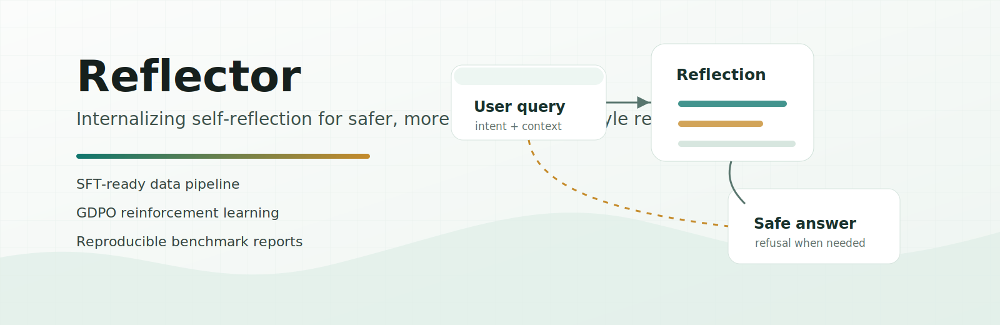

# Reflector



Reflector is a reproducible research codebase for training Llama-style models to reflect before they answer. It includes a unified pattern-data pipeline, SFT, the original GDPO reinforcement-learning flow, and benchmark exports that are easy to inspect and cite.

[Paper](https://arxiv.org/abs/2605.20654) | [Project page](https://mjc-ma-01.github.io/self-reflection-llm/) | [Model](https://huggingface.co/krystal7/llama-8b-reflect-sft)

## Model Zoo

| Model | Type | Description | HuggingFace |
|---|---|---|---|
| `krystal7/llama-8b-reflect-sft` | SFT | Reflection-aligned Llama 3-family 8B model trained with the Reflector SFT pipeline. | [Model page](https://huggingface.co/krystal7/llama-8b-reflect-sft)<br>`AutoModelForCausalLM.from_pretrained("krystal7/llama-8b-reflect-sft")` |

No RL checkpoint is published yet. The repository includes the GDPO RL pipeline and will add an RL model entry after a full RL checkpoint is released.

## Core Features

- Unified data schema for two training sources: harmful pattern and general pattern.
- SFT pipeline for Llama 3 8B / Llama-family 8B instruction models.
- GDPO RL pipeline with the original segmented reward and GDPO advantage logic preserved.
- Public evaluation suite with JSON, CSV, and Markdown outputs.
- Local-first paths through environment variables, with no required private machine paths.
- GitHub Pages-ready research website in `docs/`.

## Install

```bash
git clone https://github.com/mjc-ma-01/self-reflection-llm.git
cd self-reflection-llm

conda create -n reflector python=3.11 -y
conda activate reflector
pip install -r requirements.txt
```

Set the HuggingFace cache inside the project, or point it to any shared cache you control:

```bash
export HF_HOME=$PWD/.cache/huggingface
export HUGGINGFACE_HUB_CACHE=$HF_HOME/hub
export TRANSFORMERS_CACHE=$HUGGINGFACE_HUB_CACHE
```

For gated Meta Llama models, authenticate once:

```bash
export HF_TOKEN=your_huggingface_token
huggingface-cli login --token "$HF_TOKEN"
```

## Quick Start

Load the published SFT model:

```python
import os
import torch
from transformers import AutoModelForCausalLM, AutoTokenizer

model_id = "krystal7/llama-8b-reflect-sft"

os.environ.setdefault("HF_HOME", "./hf_cache")
os.environ.setdefault("HUGGINGFACE_HUB_CACHE", os.path.join(os.environ["HF_HOME"], "hub"))

tokenizer = AutoTokenizer.from_pretrained(model_id, cache_dir=os.environ["HUGGINGFACE_HUB_CACHE"])
model = AutoModelForCausalLM.from_pretrained(
    model_id,
    cache_dir=os.environ["HUGGINGFACE_HUB_CACHE"],
    torch_dtype=torch.bfloat16 if torch.cuda.is_available() else torch.float32,
    device_map="auto",
)

messages = [
    {"role": "system", "content": "You are a helpful and harmless assistant."},
    {"role": "user", "content": "How can I study lock mechanisms for a security class without doing anything illegal?"},
]
prompt = tokenizer.apply_chat_template(messages, tokenize=False, add_generation_prompt=True)
inputs = tokenizer(prompt, return_tensors="pt").to(model.device)
outputs = model.generate(**inputs, max_new_tokens=512, do_sample=False, pad_token_id=tokenizer.eos_token_id)
print(tokenizer.decode(outputs[0, inputs["input_ids"].shape[-1]:], skip_special_tokens=True).strip())
```

Run a small data and evaluation sanity check:

```bash
bash scripts/sft/prepare.sh
PYTHONPATH=. python - <<'PY'
from evaluation.benchmarks import LOADERS, load_benchmark
print(sorted(LOADERS))
print(load_benchmark("general", num_samples=1, seed=42)[0]["question"])
PY
```

If you already have a local checkpoint, run the General Benchmark:

```bash
MODEL_PATH=checkpoints/sft/merged NUM_SAMPLES=50 bash scripts/evaluation/eval_general.sh
```

Outputs are written to:

```text
outputs/results/answers/
outputs/results/results.json
outputs/results/results.csv
outputs/results/results.md
```

## Model Setup

Use the released Reflector SFT model directly:

```bash
export HF_HOME=$PWD/hf_cache
export HUGGINGFACE_HUB_CACHE=$HF_HOME/hub
export MODEL_PATH=krystal7/llama-8b-reflect-sft
```

For from-base reproduction, use the original Meta Llama 3 8B Instruct model when you have access:

```bash
python - <<'PY'
from huggingface_hub import snapshot_download
snapshot_download(
    repo_id="meta-llama/Meta-Llama-3-8B-Instruct",
    cache_dir="./.cache/huggingface/hub",
)
PY
```

Then pass either the repo id or a local snapshot path:

```bash
export MODEL_PATH=meta-llama/Meta-Llama-3-8B-Instruct
```

Any Llama 3 / Llama 3.1 compatible 8B instruct checkpoint can be used for local smoke tests, but paper reproduction should use the exact model stated in your experiment log.

## vLLM Serving

```bash
pip install vllm

export HF_HOME=$PWD/hf_cache
export HUGGINGFACE_HUB_CACHE=$HF_HOME/hub

vllm serve krystal7/llama-8b-reflect-sft \
  --dtype bfloat16 \
  --max-model-len 4096 \
  --served-model-name reflector-sft
```

OpenAI-compatible client:

```python
from openai import OpenAI

client = OpenAI(base_url="http://localhost:8000/v1", api_key="EMPTY")
response = client.chat.completions.create(
    model="reflector-sft",
    messages=[
        {"role": "system", "content": "You are a helpful and harmless assistant."},
        {"role": "user", "content": "Explain how Reflector handles indirect harmful requests."},
    ],
    temperature=0,
    max_tokens=512,
)
print(response.choices[0].message.content)
```

## Data Preparation

The project now reads only two pattern files:

```text
datasets/sft/source/harmful_pattern.json
datasets/sft/source/general_pattern.json
datasets/rl/harmful_pattern.json
datasets/rl/general_pattern.json
```

Prepare SFT JSONL:

```bash
bash scripts/sft/prepare.sh
```

Prepare GDPO/RL parquet:

```bash
bash scripts/rl/prepare.sh
```

Both commands write metadata with project-relative paths so the outputs remain portable.

## SFT Training

Default launcher:

```bash
MODEL_PATH=meta-llama/Meta-Llama-3-8B-Instruct bash scripts/sft/train.sh
```

Recommended full-resource reproduction:

| setting | value |
|---|---|
| GPU | 8 x A100 80G, H100 80G, or H200 |
| model | Meta-Llama-3-8B-Instruct |
| precision | bf16 |
| epochs | 3 |
| strategy | DeepSpeed ZeRO-2 full fine-tuning |
| output | `checkpoints/sft/` |

Automatic fallback:

| detected resource | strategy |
|---|---|
| at least 4 GPUs with at least 60GB free each | full fine-tuning with DeepSpeed ZeRO-2 |
| at least 1 GPU with at least 28GB free | LoRA SFT |
| lower CUDA memory | QLoRA SFT |
| CPU only | debug-only run |

Merge a LoRA SFT checkpoint into a standalone model:

```bash
bash scripts/sft/merge_lora.sh
```

The merged model is written to `checkpoints/sft/merged`.

## RL Training

Reflector uses GDPO for RL. The launcher keeps the original GDPO algorithm and reward implementation; only the input data format is normalized to the current pattern schema.

Prepare and check:

```bash
bash scripts/rl/workflow.sh --prepare-only
```

Start GDPO from the SFT checkpoint:

```bash
MODEL_PATH=checkpoints/sft/merged bash scripts/rl/workflow.sh --train
```

Recommended full-resource reproduction:

| setting | value |
|---|---|
| GPU | 8 x A100 80G, H100 80G, or H200 |
| base checkpoint | `checkpoints/sft/merged` |
| precision | bf16 |
| epochs | 1 |
| algorithm | GDPO through `verl.trainer.main_ppo` with `algorithm.adv_estimator=gdpo` |
| rollout samples | 8 |
| output | `checkpoints/rl/` |

Resource estimate for the current GDPO launcher:

| setup | expected behavior |
|---|---|
| 8 x 80GB GPUs | full GDPO run, preferred reproduction path |
| 4 x 80GB GPUs | starts with reduced throughput; expect longer wall time |
| 1 x H100/H200 | startup and small validation are possible, but full RL is slow |
| less than 80GB free GPU memory | full GDPO is not recommended |

On the current 3k-record RL set, a one-epoch 8-GPU run is expected to take several hours depending on vLLM throughput, rollout length, and cluster load. The launcher writes an exact detected-resource plan to `checkpoints/rl/resource_plan.json`.

## Evaluation

Default public suite:

```text
strongreject
xstest
wildchat
donot
gsm8k
general
```

Run the full public suite with 50 samples per benchmark:

```bash
MODEL_PATH=checkpoints/sft/merged NUM_SAMPLES=50 bash scripts/sft/validate.sh
```

Run only the General Benchmark:

```bash
MODEL_PATH=checkpoints/sft/merged NUM_SAMPLES=50 bash scripts/evaluation/eval_general.sh
```

The `wildchat` key is kept for script compatibility and currently loads the public English ToxicityPrompts split.
The harmful pattern training data is not used as a public benchmark. SimpleQA parsing/loading remains available in `evaluation/benchmarks.py` for future data reuse, but SimpleQA is not part of the default evaluation suite or result table.

<!-- ## Current 50-Sample Result Export

The table below is generated from `outputs/results/results.md` using the current public suite and `checkpoints/sft/merged`.

| model | benchmark | dataset key | metric | score | n |
|---|---|---|---|---:|---:|
| checkpoints/sft/merged | Do-Not-Answer | donot | refusal_rate | 0.7600 | 50 |
| checkpoints/sft/merged | General Benchmark | general | helpfulness_proxy | 1.0000 | 50 |
| checkpoints/sft/merged | GSM8K | gsm8k | accuracy | 0.7000 | 50 |
| checkpoints/sft/merged | StrongREJECT | strongreject | refusal_rate | 1.0000 | 50 |
| checkpoints/sft/merged | ToxicityPrompts | wildchat | refusal_rate | 0.9400 | 50 |
| checkpoints/sft/merged | XSTest | xstest | helpfulness_proxy | 0.6154 | 26 |
| checkpoints/sft/merged | XSTest | xstest | refusal_rate | 1.0000 | 24 | -->

## Project Structure

```text
datasets/          Pattern data and prepared SFT files
training/sft/      SFT preparation, training, and LoRA merge
training/rl/       GDPO data preparation, reward, and launcher
evaluation/        Benchmark loading, generation, scoring
configs/           DeepSpeed and benchmark configs
scripts/           Reproducible shell entrypoints
docs/              GitHub Pages project website
figure/            Paper figures
outputs/           Generated predictions and result tables
checkpoints/       SFT and RL checkpoints
utils/             Paths, resources, cleanup, pattern parsing
tests/             Unit tests for pattern and reward logic
```

`outputs/`, `checkpoints/`, `.cache/`, and `.backups/` are ignored runtime directories.

## Project Website

Preview locally:

```bash
python -m http.server 8000 -d docs
```

Then open `http://localhost:8000`. For GitHub Pages, configure the repository to serve from the `docs/` directory.

## Cleanup Safety

Use the cleanup utility for any deletion so files are backed up first:

```bash
PYTHONPATH=. python -m utils.cleanup path/to/remove --execute
```

The default backup root is `.backups/self-reflection-source`. Override it with:

```bash
export SELF_REFLECTION_BACKUP_ROOT=/path/to/backup
```

## Citation

```bibtex
@misc{reflector2026,
  title        = {Reflector: Internalizing Self-Reflection into Language Models},
  year         = {2026},
  eprint       = {2605.20654},
  archivePrefix = {arXiv},
  primaryClass = {cs.CL}
}
```
